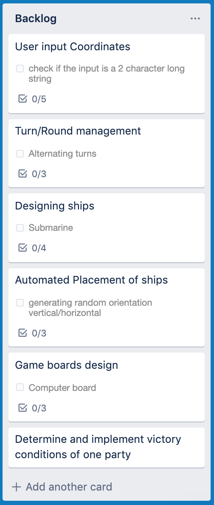
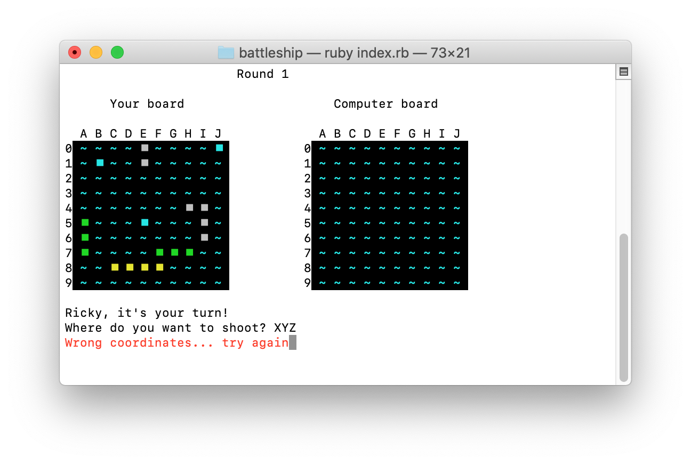

# Battleship

Github Repo: [github.com/ironest/battleship](https://github.com/ironest/battleship)

Contributors: Riccardo Carzania ([github.com/ironest](https://github.com/ironest))

### Getting started

1. Clone the **Battleship** git repository locally:
   ```shell
   git clone https://github.com/ironest/battleship.git
   ```
2. Move into the repository folder:
   ```shell
   cd battleship
   ```
3. Execute the deployment shell script:
   ```shell
   ./deploy.sh
   ```
4. Move into the **dist** folder:
   ```shell
   cd dist
   ```
5. Install external gems:
   ```shell
   gem install colorize
   ```
6. Start the app
   ```shell
   ruby index.rb
   ```
7. Enjoy!

### Manual Tests

For this project, manual tests have been designed for those features where a user is requested to manually interact with the game and more subjected to introduce errors.
Features taken in cosideration are:
1. Help message
2. User input Coordinates

For the **Help message** feature, the individual test cases are intended to stimulate the first branches of the workflow. Four different test cases have been designed, each involving the execution of the app from the terminal.
1. ```$ ruby index.rb```
2. ```$ ruby index.rb -h```
3. ```$ ruby index.rb --help```
4. ```$ ruby index.rb -xyz```

For the **User input Coordinates** feature, the individual test cases are intended to validate various inputs provided by the user while the game is running. Five different test cases have been designed, each involving the execution of the app from the terminal.

5. ```Where do you want to shoot? B5```
6. ```Where do you want to shoot? 77```
7. ```Where do you want to shoot? W3```
8. ```Where do you want to shoot? A```
9. ```Where do you want to shoot? W3```

For an extended list of Test Cases and its expected results, check [this Excel Spreadsheet](docs/manual-tests.xlsx)

### Purpose and Scope

Battleship (also Battleships or Sea Battle) is a strategy type guessing game for two players. It is normally played on ruled grids (paper or board) on which each player's fleet of ships (including battleships) are marked. The locations of the fleets are concealed from the other player. Players alternate turns calling "shots" at the other player's ships, and the objective of the game is to destroy the opposing player's fleet.

This version of the game is implemented with the Ruby programming language and offers the option of playing the game as a single player; the project is created as a terminal app and, as such, is executed and played from the command line interface. The purpose is to entertain the user by competing against the CPU, with the objective of winning the game.

The grids (battlefields) in this version are square (10×10) and the individual squares in the grid are identified by letter and number (e.g. **B5**). On one grid the players controls their own ships and records the shots by the opponent. On the other grid the player records where the opponent (the computer) shot.

Before play begins, an internal algorithm arranges ships for both the player and the computer. Each ship occupies a number of consecutive squares on the grid, arranged either horizontally or vertically. The number of squares for each ship is determined by the type of the ship. The ships cannot overlap (i.e., only one ship can occupy any given square in the grid). The types and numbers of ships allowed are the same for each player.

### Development plan

#### Brainstorming

The requirement of the project was to build an app for the command line, which is usually an unfriendly environment for the average user. Due to this, my brainstorming process was heavily affected by the urge of making something fun and enjoyable for "average user". With that in mind, I decided to go for a simple game.
Usually, a game is more enjoyable when there's graphic, animations, colors and mouse-inputs but, once again, the "command line" requirement brings in some strong constraints. That means the game has to leverage more the art of "patience" and "strategy" rather than visual effects.

This is why I decided to recreate the old BattheShip game:
 * it doesn't need animation
 * it doesn't need graphic
 * it doesn't necessarily require input from a mouse

I proposed my idea to my tech leader, Gareth, who luckily approved it.
The early stage of my plan was spent on Trello, a web-based task management app that gives a visual overview of what needs to be done and who works on what. Generically speaking, Trello looks like a whiteboard filled with post-it notes. Obviously, I started with an empty board and, from there, I started filling in my own tasks and ideas.

#### Plan priority

I decided to break down the project into several smaller tasks, so that it would be easier to focus on one challenge at a time, without being distracted by the overall solution. In order of priority, below are are the blocks I planned:

1. High level design of which elements are needed in the game
   * Player board
   * Computer board
   * List of ships
      * Submarine (represented by ◼)
      * Destroyer (represented by ◼◼)
      * Cruiser (represented by ◼◼◼)
      * Aircraft Carrier (represented by ◼◼◼◼)
   * Turn counter
   * Turn alternation
   * Victory condition
   * Basic visualization of each board
2. Data structures needed to represent each element from previous point
   * Array of arrays for the Player board and Computer board
   * Array for the List of ships
   * Integer for the Turn counter
   * Method returning a boolean value for the Victory condition
3. Outline possible values/constants to represent each state of complex data structures
   * Constants for board sizes
   * Hash for states and colors of each cell on the boards
4. Decide which inputs are required from a user
   * Nickname
   * Coordinates of where to shoot
   * Coordinates of where to place own ships (this is a nice to have)
5. Game mechanics
   * When/How to initialize data structures?
   * What determines the turn alternation?
   * How/when to check for Victory condition
6. Cosmetic matters
   * Splash screen when the game starts
   * Colored output messages
   * Slowing down turn alternations to give the game a "human" feeling with usage of "sleep" instructions

| Feature | Checklist | Priority | Deadline |
|------------------|--------------------|-------------------|-------------------|
|User input Coordinates|◼ check if the input is a 2 character long string<br />◼ check if the 1st character is a letter<br />◼ check if the 1st character is in the range A..J (or a..j)<br />◼ check if the 2nd character is a number<br />◼ check if the 2nd character is in the range 0..9|High|03/09/2019|
|Automatic ship placement|◼ generating random orientation vertical/horizontal<br />◼ generating random coordinates to place a ship<br />◼ verify if the calculated position would fit ships of different sizes<br />◼ checking if every cell needed to sit a ship is not occupied<br />|High|04/09/2019|
|Help message| ◼ Research ARGV<br />◼ Design a method to print out the help msg<br />◼ Implement the condition to deviate the normal flow of the app to the help msg method |Low|05/09/2019|

Here is what my Trello board looked like after finishing breaking down the project into smaller elements



### Features

#### Feature 1 - User input Coordinates

One of the most important feature of the Battleship app revolves around users beign able to provide their own input as coordinates. This aspect is fundamental to give players that sense of being active in the game. That said, user inputs are potentially subjected to human errors, meaning that anything manually typed must go through a validation layer, before taking into consideration the data inputted. The nature of the input must be supplied as a 2 character long string, in the shape of <*letter*><*digit*> such as **B5**.
A user input is read by the instruction `coordinates = gets.chomp()` and, depending on whether or not the `coordinates` variable satisfies the expected syntax, the game proceeds or requests the user to re-enter another input.

Below a snippet of the code responsible for the input validation:
```ruby
def validate_coordinates( input )
    return false if input.length != 2
    return false if !is_number?(input[1])
    return false if !((0..9).include?(input[1].to_i))
    return false if !(("A".."J").include?(input[0].upcase))
    return true
end

while true
   print "Where do you want to shoot? "
   coordinates = gets.chomp
   break if validate_coordinates(coordinates)
   print "Wrong coordinates: type something like \"B5\" or \"b7\". Try again"
end
```

#### Feature 2 - Automatic ship placement

One of the hardest steps while building this game, was to decide how to give players the option to place their ships. Mainly, the difficulties would have been around:
 * Constantly validating user input coordinates
    * are inputs syntattically valid? (*{letter}{number}*)
    * are inputs logically valid? (withing the board ranges)
    * even if the provided coordinates are valid, is the ship lenght going to fit in the board from the location chose?
    * even if the provided coordinates are valid and the ship lengh does fit the board, what if any of the slot are already occupied from another ship previously placed?

All these scenario would give a user an hard time in placing objects on the battlefield and that would surely be a not user friendly interaction. That's why I decided to create an algorithm to randomly place each ship on a user behalf. Conveniently enough, such algorithm would have been needed anyway, to automatically place the enemy (computer owned) ships.

So, how does the algoritmh work?

1. At the time the game start, each board is initialized with `0` values in each cell
   ```Ruby
   for x in cols
      board[x] = []
      for y in rows
         board[x][y] = 0
      end
   end
   ```
2. Once each board is initialized, it's time to place the ships. The app maintains a ship formation in a linear array, where each slot of such array, contains the lenght of each ship (represented as an integer). Basically, for each number held in the array, I have to invoke a method (`random_place_ship`) to place such ship on a specified board (either the player or the opponent ones).
   * The method randomly decides whether to place the ship vertically or horizontally.
   * Depending on the orientation and on the lenght of the ship, calculates the max horizontal and vertical range to where the ship can potentially fit
   * Two random numbers are generated respectively for the horizontal and vertical range and are used as *starting point* to where the ship can sit
   * Lastly, a loop verifies that, from the calculated *starting point*, every required slot is available (not already occupied). If they are, the algorithm ends. If at least one slot is not available, the algoritm restarts.

   Below the snipped code of the algorithm

   ```Ruby
   def random_place_ship(size, board)

      fit = false
      until fit do
      
         max_x = 9
         max_y = 9
         newBoard = Marshal.load( Marshal.dump(board) )

         if rand(0..1) == 0
               orientation = :vertical
               max_x = 9 - size
         else
               orientation = :horizontal
               max_y = 9 - size
         end
         x = rand(0..max_x)
         y = rand(0..max_y)

         for cell in 1..size
            if newBoard[x][y] == 0
               fit = true
               newBoard[x][y] = size
            else
               fit = false
               break
            end

            if orientation == :vertical
               x+=1
            else
               y+=1
            end
         end
      end

      return newBoard

   end
   ```

#### Feature 3 - Help message

A terminal app cannot be considered complete without a proper help menu.
Reason to have such feature can probably be summarized under two points:
 * Description of what the app does
 * Usage syntax on how to interact with the app itself

So, what does that mean for my app? The asnwer is: arguments!
Ruby script arguments are passed to the Ruby program by the shell, the program that accepts commands on the terminal. On the command-line, any text following the name of the script is considered a command-line argument. Separated by spaces, each word or string will be passed as a separate argument to the Ruby program. 
Ruby captures arguments in a special array named ARGV which holds, as strings, each argument passed by the shell.

Specifically for my scenario, I designed to have a couple of option to be recognized as valid and which trigger my app with a different behaviour:
 * `-h`
 * `--help`

Whenever my app is executed with one of the above options, an help message is displayed to the user.

From my `index.rb` file, here is the snippet of code that intercept arguments:
```Ruby
argv_copy = ARGV.map{ |i| i }
ARGV.clear
check_options(argv_copy)
```

The actual code that verifies (and validates) the presence of potential arguments is implemented in the `check_options` method. Below the code:

```Ruby
HELP_OPTIONS = ["-h", "--help"]

def check_options (array)

    return if array.length == 0

    for opt in HELP_OPTIONS
        if array.include?(opt)
            display_help_message()
            exit
        end 
    end

    print "Illegal option: "
    array.map {|x| print "#{x} "}
    puts "Use [-h] or [--help] to access the help menu"

    exit
end
```

The result of executing the app `index.rb` with an argument which does not match `-h` or `--help` will 
```
$ ruby index.rb -xyz
Illegal option: -xyz 
Use [-h] or [--help] to access the help menu
```

### User Interaction and Experience

The Battleship game has a simple design which relies on a linear interaction, where a user is never requested to make a choice with multiple options or proposed a menu where to choose from more than one path. The inputs required are straightforward.
When the game start, a welcoming message is printed and a big splash-screen is showed. Right underneath the splash-screen, the user is prompted to type his/her name for a more personalized experience.


Once a name is provided, the player is brought to the main screen of the game, where two visual battle-fields are rendered:
 * the player's board
 * the opponent's board

To make easier to distinguish which one is which, a label floats above each board


When players get to the point where they are required to supply coordinates to where they want to shoot, the expected syntax is in the form of {letter}{number} such as (for example) **B5**. In the eventuality that the provided input does not satisfy the desired syntax, a *discret* red warning is displaied and a new attempt is prompted:



### Control Flow Diagram


### Status Updates

A link to my Status Updates can be found [here on GitHub](docs/development-log.md)
