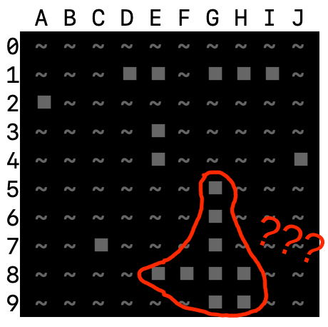
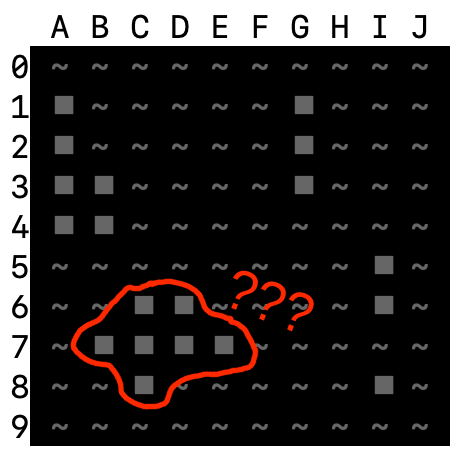
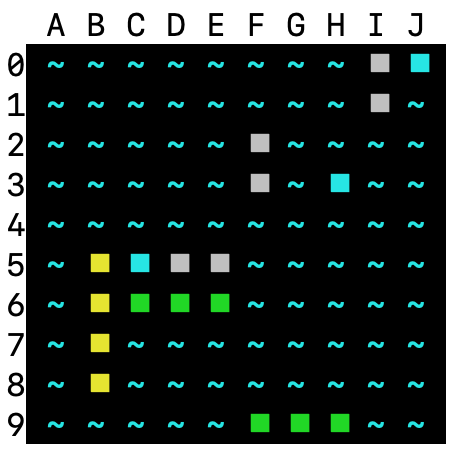

# Battleship #

Github Repo: github.com/ironest/battleship.git

Contributors: Riccardo Carzania (github.com/ironest)

### Description ###

This project implements the famous Battleship game with the Ruby programming language. The game is created as a terminal app and, as such, is executed and played from the command line interface. 

#### Purpose ####

The app's purpose is to entertain a single user player who competes against the CPU, with the objective of winning the game.

### Development plan ###

#### Brainstorming ####

The main requirement of the project is to build an app for the command line, which is usually an unfriendly environment for the average user. Due to this, my brainstorming process was heavily affected by the urge of making something fun and enjoyable for "average user". With that in mind, I decided to go for a simple game.
Usually, a game is more enjoyable when there's graphic, animations, colors and mouse-inputs but, once again, the "command line" requirement brings in some strong constraints. That means the game has to leverage more the art of "patience" and "strategy" rather than visual effects.

This is why I decided to recreate the old BattheShip game:
 * it doesn't need animation
 * it doesn't need graphic
 * it doesn't necessarily require input from a mouse

I proposed my idea to my tech leader, Gareth, who luckily approved it.
The early stage of my plan was spent on Trello, a web-based task management app that gives a visual overview of what needs to be done and who works on what. Generically speaking, Trello looks like a whiteboard filled with post-it notes. Obviously, I started with an empty board and, from there, I started filling in my own tasks and ideas.

#### Plan priority ####

I decided to break down the project into several smaller tasks, so that it would be easier to focus on one challenge at a time, without being distracted by the overall solution. In order of priority, below are are the blocks I planned:

1. High level design of which elements are needed in the game
   * Player board
   * Computer board
   * List of ships
      * Submarine (represented by ◼)
      * Destroyer (represented by ◼◼)
      * Cruiser (represented by ◼◼◼)
      * Aircraft Carrier (represented by ◼◼◼◼)
   * Turn counter
   * Turn alternation
   * Victory condition
   * Basic visualization of each board
2. Data structures needed to represent each element from previous point
   * Array of arrays for the Player board and Computer board
   * Array for the List of ships
   * Integer for the Turn counter
   * Method returning a boolean value for the Victory condition
3. Outline possible values/constants to represent each state of complex data structures
   * Constants for board sizes
   * Hash for states and colors of each cell on the boards
4. Decide which inputs are required from a user
   * Nickname
   * Coordinates of where to shoot
   * Coordinates of where to place own ships (this is a nice to have)
5. Game mechanics
   * When/How to initialize data structures?
   * What determines the turn alternation?
   * How/when to check for Victory condition
6. Cosmetic matters
   * Splash screen when the game starts
   * Colored output messages
   * Slowing down turn alternations to give the game a "human" feeling with usage of "sleep" instructions

Here is what my Trello board looked like after finishing breaking down the project into smaller elements


### Features ###

#### 1. Coordinates (from user input) ####

One of the most important feature of the app revolves around a user beign able provide their own input to be used at coordinates. This aspect is fundamental to give a player that sense of being actively engaged in the game. That said, user inputs are potentially subjected to human errors, meaning that anything manually typed must go through a validation layer, before taking into consideration the data inputted.

The nature of the input must be supplied as a 2 character long string, in the shape of <*letter*><*digit*> such as **B5**.
A user input is read by the instruction `coordinates = gets.chomp()` and, depending on whether or not the `coordinates` variable satisfies the expected syntax, the game proceeds or requests the user to re-enter another input.

Below a snippet of the code responsible for the input validation:
```ruby
def validate_coordinates( input )
    return false if input.length != 2
    return false if !is_number?(input[1])
    return false if !((0..9).include?(input[1].to_i))
    return false if !(("A".."J").include?(input[0].upcase))
    return true
end

while true
   print "Where do you want to shoot? "
   coordinates = gets.chomp
   break if validate_coordinates(coordinates)
   print "Wrong coordinates... try again"
end
```

#### 2. TBD ####

Lorem ipsum dolor sit amet, consectetur adipiscing elit. Suspendisse ut varius massa. Quisque eu elit sed odio tristique eleifend vitae vitae leo.

#### 3. TBD ####

Lorem ipsum dolor sit amet, consectetur adipiscing elit. Suspendisse ut varius massa. Quisque eu elit sed odio tristique eleifend vitae vitae leo.

### User Interaction and Experience

Lorem ipsum dolor sit amet, consectetur adipiscing elit. Suspendisse ut varius massa. Quisque eu elit sed odio tristique eleifend vitae vitae leo.

### Control Flow Diagram


### Status Updates ###

#### 1. Battleship board data structure (03/08/2019) ####

The Battleship game I am creating revolves around the concept of maintaining a 10x10 matrix with data in it. To achieve such requirement, I am using the Ruby built-in Array class and am also using each element of such array to hold values of other 10 arrays. In total I'll have 11 arrays, each with length equal to 10.
Now that the data structure is ready, I have to create a logic on how to
 * initialize each *cell* of the matrix
 * how to keep track of those ships that spans across multiple cells
 * how to *render* each cell on the command line

I came up with the following idea

Value in memory | Render graphic | Meaning
------------ | ------------- | -------------
0 | ~ | The cell contains water
1 | ◼ | The cell contains a piece of ship
-2 | ◉ | The cell contains a damaged ship
-1 | " " | The cell contains nothing

The implemention of the above logic was achieved by leveraging an Hash data structure (in the form of a costant).

```Ruby
Ship_colors = {
    0 => :light_cyan,     # empty / water
    1 => :light_black,    # ship
    -1 => :light_cyan,    # shot in water
    -2 => :light_red,     # ship got hit
}
```

To initialize the matrix I created an adhoc method that performs a two level loops

```ruby
def init_board
    board = []
    cols = rows = 0..9
    for x in cols
        board[x] = []
        for y in rows
            board[x][y] = 0
        end
    end
    return board
end
```

If my reasoning is right, I could simply print each cell by looping through all the slots of my array-of-array. Obviously, to keep my code as DRY as possible, I wrote an adhoc method to print each element of the board

```Ruby
def render_cell(cell_value)
    text_color = Ship_colors[cell_value]
    case cell_value
    when 0
        symbol = "~"
    when -2
        symbol = "◉"
    when -1 
        symbol = " "
    else
        symbol = "◼"
    end
    print "#{symbol}".colorize(:color => text_color, :background => :black)
end
```

#### 2. Horrible visual bug (04/08/2019) ####


I did my best to ignore a cosmetic issue... but I sincerely can't stand it anymore.
Since the ships are autonomously placed on the board by the game itself, whenever two (or more) ships sit next to each other, the user has little or no chance to distinguish them apart and, sometimes, it's also impossible to determine the orientation of a ship.
Below an example:

 

Usually cosmetic issues are not important and should to be left as those with the lowest priority tasks to work on but... for a game, I felt this problem was quite bothering. I so decided to do a bit or rethinking and refactoring some of the code to include real colors which could have improved the ability to read objects on the board.

Below is a revisited version of the definition of symbols

Value in memory | Render graphic | Meaning
------------ | ------------- | -------------
0 | <span style='color:blue'>~</span> | The cell contains water
1 | <span style='color:cyan'>◼</span> | The cell contains a submarine
2 | <span style='color:gray'>◼◼</span> | The cell contains a (piece of) destroyer
3 | <span style='color:lime'>◼◼◼</span> | The cell contains a (piece of) cruiser
4 | <span style='color:yellow'>◼◼◼◼</span> | The cell contains a (piece of) aircraft carrier
-2 | <span style='color:red'>◉</span> | The cell contains a damaged ship
-1 | " " | The cell contains nothing

Similarly, I had to transfer the above cosmetic changes into my original Hash data structure

```Ruby
Ship_colors = {
    4 => :light_yellow,   # aircraft carrier
    3 => :light_green,    # cruiser
    2 => :white,          # destroyer
    1 => :light_cyan,     # submarine
    0 => :light_cyan,     # empty / water
    -1 => :light_cyan,    # shot in water
    -2 => :light_red,     # ship got hit
}
```

Interesting enough, the nice way I deteached the logic of colors from the code, paid me back; I simply had to apply minimal changes to my Hash data structure and had absolutely no impact on the rest of my code; the `render_cell` required no change at all.

Below are a couple of samples produced with the new version of the board

 
