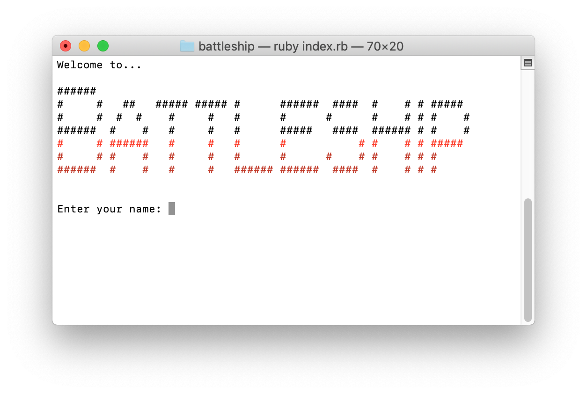
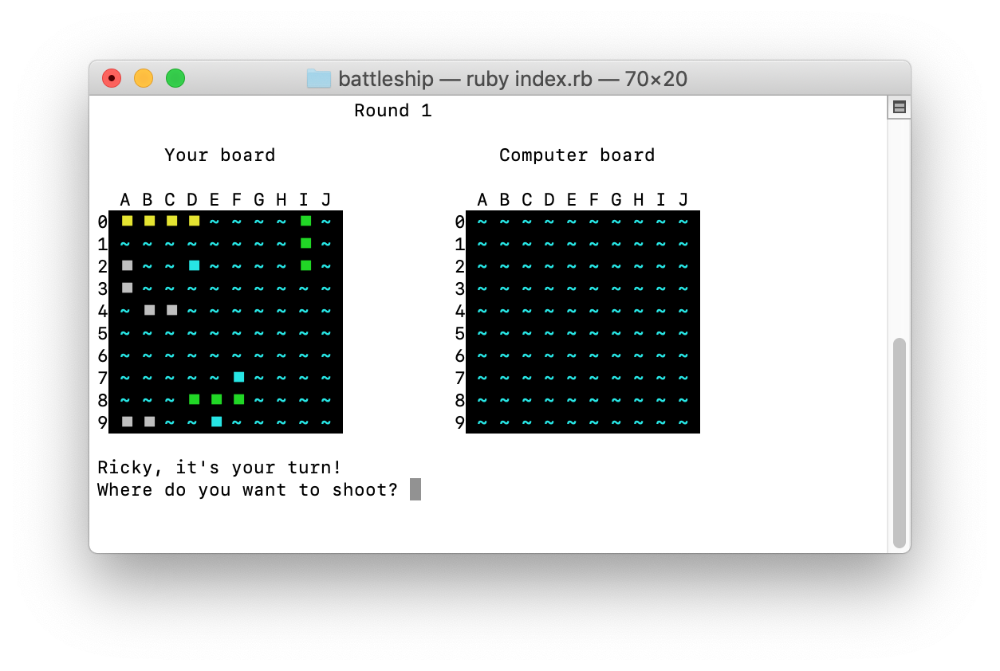
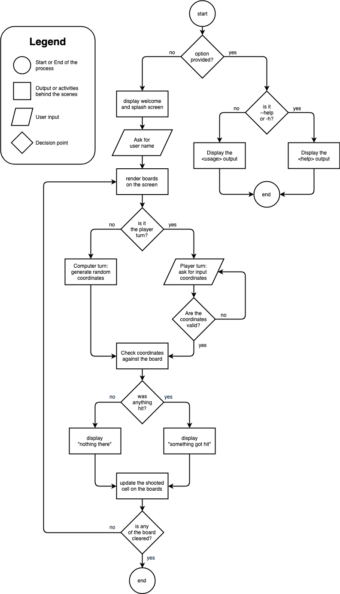

# Software Development Plan
### Statement of Purpose and Scope
### Features

##### Feature 1 - User input Coordinates

One of the most important feature of the Battleship app revolves around users beign able to provide their own input as coordinates. This aspect is fundamental to give players that sense of being active in the game. That said, user inputs are potentially subjected to human errors, meaning that anything manually typed must go through a validation layer, before taking into consideration the data inputted. The nature of the input must be supplied as a 2 character long string, in the shape of <*letter*><*digit*> such as **B5**.
A user input is read by the instruction `coordinates = gets.chomp()` and, depending on whether or not the `coordinates` variable satisfies the expected syntax, the game proceeds or requests the user to re-enter another input.

Below a snippet of the code responsible for the input validation:
```ruby
def validate_coordinates( input )
    return false if input.length != 2
    return false if !is_number?(input[1])
    return false if !((0..9).include?(input[1].to_i))
    return false if !(("A".."J").include?(input[0].upcase))
    return true
end

while true
   print "Where do you want to shoot? "
   coordinates = gets.chomp
   break if validate_coordinates(coordinates)
   print "Wrong coordinates: type something like \"B5\" or \"b7\". Try again"
end
```

##### Feature 2 - TBD

##### Feature 3 - TBD

300 words (approx. 100 words per feature)
Ensure that your features include the following language elements and concepts:
 * use of variables and the concept of variable scope
 * loops and conditional control structures
 * error handling

### User Interaction and Experience

The Battleship game has a simple design which relies on a linear interaction, where a user is never requested to make a choice with multiple options or proposed a menu where to choose from more than one path. The inputs required are straightforward.
When the game start, a welcoming message is printed and a big splash-screen is showed. Right underneath the splash-screen, the user is prompted to type his/her name for a more personalized experience.

Once a name is provided, the player is brought to the main screen of the game, where two visual battle-fields are rendered:
 * the player's board
 * the opponent's board

To make easier to distinguish which one is which, a label floats above each board



 * how the user will find out how to interact with / use each feature
 * how the user will interact with / use each feature
 * how errors will be handled by the application and displayed to the user

### Control Flow Diagram

