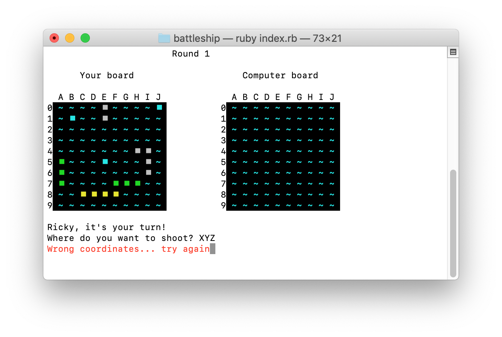

# Software Development Plan
### Statement of Purpose and Scope
### Features

##### Feature 1 - User input Coordinates

One of the most important feature of the Battleship app revolves around users beign able to provide their own input as coordinates. This aspect is fundamental to give players that sense of being active in the game. That said, user inputs are potentially subjected to human errors, meaning that anything manually typed must go through a validation layer, before taking into consideration the data inputted. The nature of the input must be supplied as a 2 character long string, in the shape of <*letter*><*digit*> such as **B5**.
A user input is read by the instruction `coordinates = gets.chomp()` and, depending on whether or not the `coordinates` variable satisfies the expected syntax, the game proceeds or requests the user to re-enter another input.

Below a snippet of the code responsible for the input validation:
```ruby
def validate_coordinates( input )
    return false if input.length != 2
    return false if !is_number?(input[1])
    return false if !((0..9).include?(input[1].to_i))
    return false if !(("A".."J").include?(input[0].upcase))
    return true
end

while true
   print "Where do you want to shoot? "
   coordinates = gets.chomp
   break if validate_coordinates(coordinates)
   print "Wrong coordinates: type something like \"B5\" or \"b7\". Try again"
end
```

##### Feature 2 - Automatic ship placement

One of the hardest steps while building this game, was to decide how to give players the option to place their ships. Mainly, the difficulties would have been around:
 * Constantly validating user input coordinates
    * are inputs syntattically valid? (*{letter}{number}*)
    * are inputs logically valid? (withing the board ranges)
    * even if the provided coordinates are valid, is the ship lenght going to fit in the board from the location chose?
    * even if the provided coordinates are valid and the ship lengh does fit the board, what if any of the slot are already occupied from another ship previously placed?

All these scenario would give a user an hard time in placing objects on the battlefield and that would surely be a not user friendly interaction. That's why I decided to create an algorithm to randomly place each ship on a user behalf. Conveniently enough, such algorithm would have been needed anyway, to automatically place the enemy (computer owned) ships.

So, how does the algoritmh work?

1. At the time the game start, each board is initialized with `0` values in each cell
   ```Ruby
   for x in cols
      board[x] = []
      for y in rows
         board[x][y] = 0
      end
   end
   ```
2. Once each board is initialized, it's time to place the ships. The app maintains a ship formation in a linear array, where each slot of such array, contains the lenght of each ship (represented as an integer). Basically, for each number held in the array, I have to invoke a method (`random_place_ship`) to place such ship on a specified board (either the player or the opponent ones).
   * The method randomly decides whether to place the ship vertically or horizontally.
   * Depending on the orientation and on the lenght of the ship, calculates the max horizontal and vertical range to where the ship can potentially fit
   * Two random numbers are generated respectively for the horizontal and vertical range and are used as *starting point* to where the ship can sit
   * Lastly, a loop verifies that, from the calculated *starting point*, every required slot is available (not already occupied). If they are, the algorithm ends. If at least one slot is not available, the algoritm restarts.

   Below the snipped code of the algorithm

   ```Ruby
   def random_place_ship(size, board)

      fit = false
      until fit do
      
         max_x = 9
         max_y = 9
         newBoard = Marshal.load( Marshal.dump(board) )

         if rand(0..1) == 0
               orientation = :vertical
               max_x = 9 - size
         else
               orientation = :horizontal
               max_y = 9 - size
         end
         x = rand(0..max_x)
         y = rand(0..max_y)

         for cell in 1..size
            if newBoard[x][y] == 0
               fit = true
               newBoard[x][y] = size
            else
               fit = false
               break
            end

            if orientation == :vertical
               x+=1
            else
               y+=1
            end
         end
      end

      return newBoard

   end
   ```

##### Feature 3 - Help message

A terminal app cannot be considered complete without a proper help menu.
Reason to have such feature can probably be summarized under two points:
 * Description of what the app does
 * Usage syntax on how to interact with the app itself

So, what does that mean for my app? The asnwer is: arguments!
Ruby script arguments are passed to the Ruby program by the shell, the program that accepts commands on the terminal. On the command-line, any text following the name of the script is considered a command-line argument. Separated by spaces, each word or string will be passed as a separate argument to the Ruby program. 
Ruby captures arguments in a special array named ARGV which holds, as strings, each argument passed by the shell.

Specifically for my scenario, I designed to have a couple of option to be recognized as valid and which trigger my app with a different behaviour:
 * `-h`
 * `--help`

Whenever my app is executed with one of the above options, an help message is displayed to the user.

From my `index.rb` file, here is the snippet of code that intercept arguments:
```Ruby
argv_copy = ARGV.map{ |i| i }
ARGV.clear
check_options(argv_copy)
```

The actual code that verifies (and validates) the presence of potential arguments is implemented in the `check_options` method. Below the code:

```Ruby
HELP_OPTIONS = ["-h", "--help"]

def check_options (array)

    return if array.length == 0

    for opt in HELP_OPTIONS
        if array.include?(opt)
            display_help_message()
            exit
        end 
    end

    print "Illegal option: "
    array.map {|x| print "#{x} "}
    puts "Use [-h] or [--help] to access the help menu"

    exit
end
```

The result of executing the app `index.rb` with an argument which does not match `-h` or `--help` will 
```
$ ruby index.rb -xyz
Illegal option: -xyz 
Use [-h] or [--help] to access the help menu
```

### User Interaction and Experience

The Battleship game has a simple design which relies on a linear interaction, where a user is never requested to make a choice with multiple options or proposed a menu where to choose from more than one path. The inputs required are straightforward.
When the game start, a welcoming message is printed and a big splash-screen is showed. Right underneath the splash-screen, the user is prompted to type his/her name for a more personalized experience.

Once a name is provided, the player is brought to the main screen of the game, where two visual battle-fields are rendered:
 * the player's board
 * the opponent's board

To make easier to distinguish which one is which, a label floats above each board


 * how the user will find out how to interact with / use each feature
 * how the user will interact with / use each feature
 * how errors will be handled by the application and displayed to the user

When players get to the point where they are required to supply coordinates to where they want to shoot, the expected syntax is in the form of {letter}{number} such as (for example) **B5**. In the eventuality that the provided input does not satisfy the desired syntax, a *discret* red warning is displaied and a new attempt is prompted:



### Control Flow Diagram

